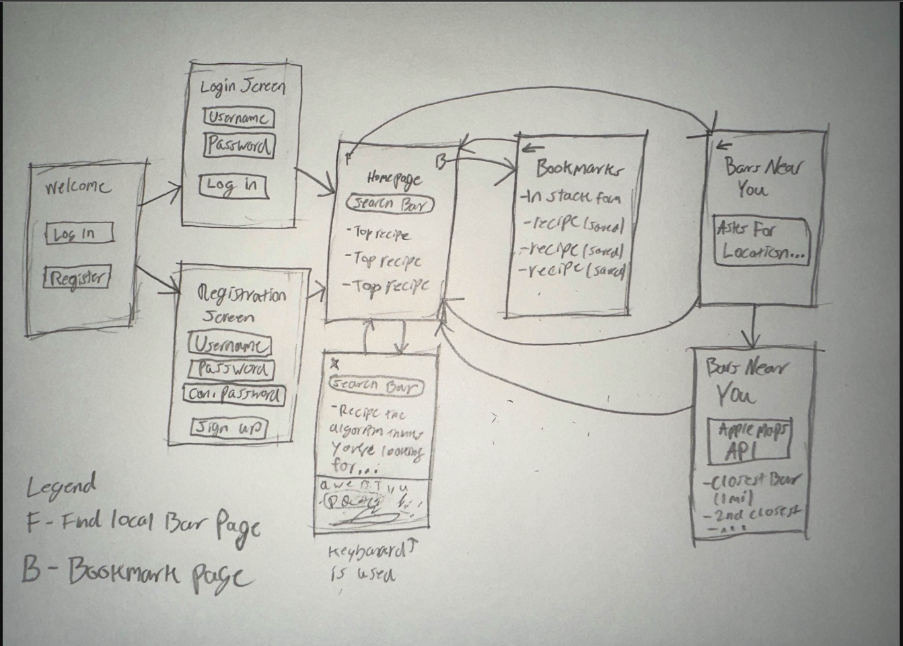

# Original App Design Project - README Template

## iBartender

### Overview

***Description***
[Provide a brief description of your app, its purpose, and functionality.]

This app would be for enternainment and some adult fun.  Will be able to search cocktails to make via ingredients or overal liquor selected.

***App Evaluation***
[Evaluation of your app across the following attributes]

- Category: Entertainment
- Mobile: Yes
- Story: To have a fun night with friends (responsibly)
- Market: Adults over the age of 21
- Habit: Occasional, usually on weekends
- Scope: Narrow

## Product Spec
**1. User Stories (Required and Optional)**  

***Required Must-have Stories***
- User can register an account
- User can log in when account is created
- User can search by cocktail
- User can also search by ingredients

***Optional Nice-to-have Stories***
- User can rate cocktails
- User can contribute a recipe
- User can find a local bar

**2. Screen Archetypes**
[Screen Name, e.g., Login Screen]
[Required User Feature: User can log in.]
[Another Screen Name]
[Associated required user story]

- ***Welcome Screen***
    - User chooses to log in or register
- ***Login Screen***
    - User can log with this page
- ***Regristration Screen***
    - User can create account to access app
- ***Home page (Shows the top cocktail recipes)***
    - Search recipes
    - Searching recipes with ingredients
    - User landing page. Search functionality is found here as well.
- ***Find Bars near you***
    - User can find local bars using Apple map api.
- ***Saved Recipes***
    - User can view saved cocktail recipe's.

**3. Navigation**
#### Tab Navigation (Tab to Screen)
- "F" leads to Find Local Bars Page
- "B" leads to Bookmarks Page

#### Flow Navigation (Screen to Screen)

Welcome Page
 - Leads to either Login Page or Signup Page

Login Page
 - Leads to home page

Signup Page
 - Leads to home page

Homepage View
 - Can lead to bookmarks page
 - Can lead to find local bars page

Wireframes
[Add picture of your hand sketched wireframes in this section]

**4. Tasks**
- Create a Welcome Page (Ethan)
- Create Sign up Page (Ethan)
- Create Login Page (Ethan)
- Create Homepage (Amin)
- Create Saved Recipes Page (Christian)
- Create FIndBarNearYou Page (Christian)
- Integrate Apple Maps (Christian)
- Setup Firebase Account credentials database (Cesar)
- Setup Saved Recipes collection for the specified accounts (Cesar)
- Integrate CocktailDB (Amin)
- Search Algorithm (Amin)

